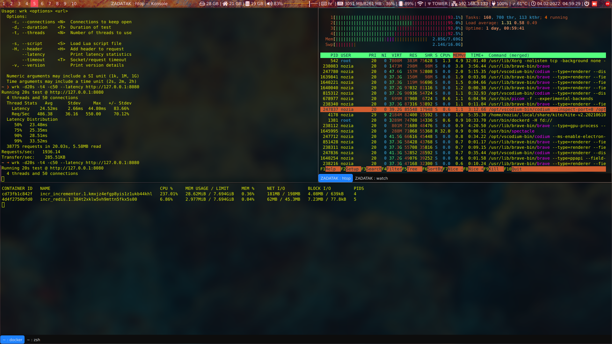
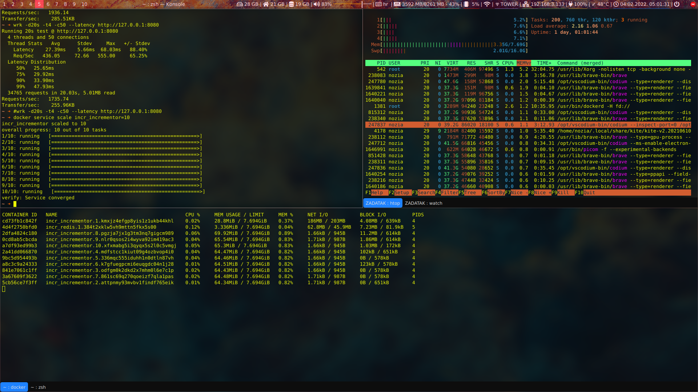
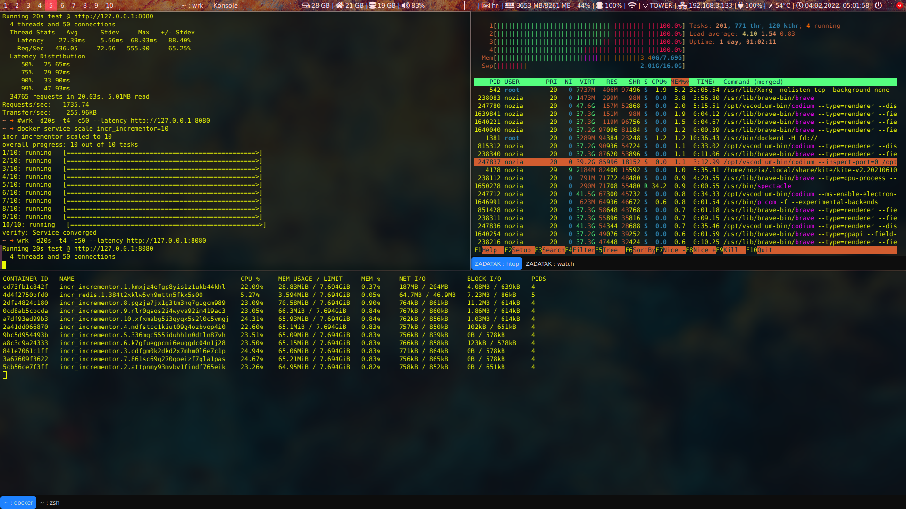

# Docker Swarm redis incrementor project
Cilj projekta:
- Zadatak (1) => stvoriti docker image u proizvoljnom jeziku koji inkrementira kljuc u redisu
- Zadatak (2) => deployati navedeni image u swarm i skalirati ga na 10 instanci
- Zadatak (3) => usporediti performanse na zadatke (1) i (2)

## Zadatak 1
Zadatak 1 pisan je u python-u koristeci flask i flask_restful framework. Napravio sam jednostavni web servis koji posjetom stranicu inkrementira brojač i vrati vrijednost.
Ako pak želimo resetirati brojac, to mozemo uciniti posjetom na adresu `/reset`, što resetira brojač i vari njegovo trenutno (resetirano) stanje.
Želimo li vidjeti stanje brojaca bez da ga inkrementiramo ili resetiramo, to možemo učiniti posjetom na `/counter`.

## Zadatak 2
Projek je testiran kreiranje docker swarma na 1 i na 2 odvojena računala na istoj lokalnoj mrezi.
Obzirom da sam imao neke probleme u pocetku pokusavajuci stovriti docker swarm između vm-a i laptopa, deployao sam docker swarm koristeci iduci naredbu:

`docker stack deploy -c docker-compose-deploy-stack.yml incr`

Alternativno bih kreirao zajednicku backend mrezu

`docker network create --driver overlay backend`

te unutar iste dodado dvije odvojene instance, prvo **redis** a zatim **incrementor**

`docker service create --name redis --network backend -p 6379:6379 redis:6.2.6-alpine`

`docker service create --name incrementor --network backend -p 80:8080 -e REDIS_SERVER=redis bornostojak/incrementor:0.1.2`

Kako bih skalirao broj **incrementor** instanci na 10

`docker service scale incrementor=10`

**PITANJE: Da li 10 instanci znaci 10x vece performanse?**

ODGOVOR: NE. Ovisno o alikaciji skaliranje aplikacije može utjecati na njezine performanse. **Ovjde to nije sličuaj**, barem ne pod okolnostima pod kojima sam ja vodio testiranja. Pod dobrim okolnostima skaliranjem u swarmu možemo postići redundanciju i *load balancing* kako bi mogli istovremeno usluživati veći broj korisnika brže i nesmetano, ali nam također ovisi o bazi podataka i drugim čembenicima, ne samo o broju instanic web aplikacije.

## Zadatak 3

Za izvođenje benchmarka korišten je alat `wrk`. Većinu benchmarkova sam radio isključivo na svojoj mašini jer sam imao problema sa umrežavanjem virtualnih mašina i računala uz ograničene resurse na laptopu kojeg imam, pa sam iznimno u jednom trenutku uspio dodati u swarm drugo zasebno računalo. Rezultati tih benchmarkova i TCPDump izlazi (koji su pokrenuti na dockerbridge network interface od mojega laptopa) vidljivi su u folderu `tests` u dvije zasebne zip mape, radi veličine tcpdump datoteka.

Benchmark sam vrtio u 3 konfiguracije:

- 1 instanca flask applikacije i 1 redis instanca
- 10 instanca flask applikacije i 1 redis instanca
- 10 instanca flask applikacije i 10 redis instanca

*Razumno je da u zadnjem slućaju 10 odvojenih instanci redisa u konfiguraciji nema smisla, obzirom da će svaka voditi brigu o svojem kljuću i inkrementirati ćemo 10 odvojenih kljućeva, ali to sam napravio kako bih usporedilo odnos redis instanci i app instanci 1:1.

### Resursi mašine tokom benchmarka 1. zadatka

### Resursi mašine tokom benchmarka 2. zadatka - neopterećeno

### Resursi mašine tokom benchmarka 2. zadatka - uz opterećenje

Iz benchmarkova je vidljivo da 10 instanci aplikacije u nasem slucaju ne poboljšava, a negdje čak i negativno utječe na performanse aplikacije. Moja je pretopstavka da je razlog tome činjenica da sam istovremenu na ručanlu vrtio više instanci aplikacije što je samo po sebi opteretilo procesor, a dodatno su ga opteretile i druge aplikacije koje su se istovremeno vrtile na računalu te sami `wrk` benchmark koji je radio u pozadini, što je bilo vidljivo dok su performanse porasle kada sam `tee` komandu, preko koje sam spremao `tcpdump` izlaz u datoteku, zamijenio `STDOUT >` operatorom.

---

**Koje biste arhitekturalne ili konfiguracijske promjene predložili za maksimizaciju performansi na
1 serveru, ali i hipotetičkoj arhitekturi na više servera? Kako biste orkestrirali redis instance
naspram servisnih instanci?**

U docker swarmu bih imao više od jednog računala, barem 2 za redundanciju i osiguravanje da pad jednog računala ne obori aplikaciju, a zatim i više račnala ovisno o opterećenu i potrebi. Poželjno bih docker swrom deploy izve na nekoj cloud platformi i dodatno se osigurao od lokalnih utjecaja poput dugotrajnog nestanka struje i drugih sličnih negativnih faktore. Konfiguracijski bih za image išao minimalističkim putem, koristeći minimalne verzije potrebne kako bi aplikacija ispravno radila, npr. `alpine` distribucija pojedinog docker image-a. Također bih redis instancirao više nego jednom, a broj instanci bih dodatno optimizaro ovisno o implementaciji. Problem nam stavara činjenica da ovisno o broju mašinia koje se nalaze u swarmu, nije lako međusobno dijeliti docker volume kako bi redis instancie radile sa istim podatcima, a ne "svaka svoju pjesmu pjevala". Moguće je dovesti neke "3rd party" drivere za volume, koristit "AWS elastic file system", redis sentinel ili duga rješenja koja bi nam omogućila održavanje više redis instanci kao jednu bazu podataka. 